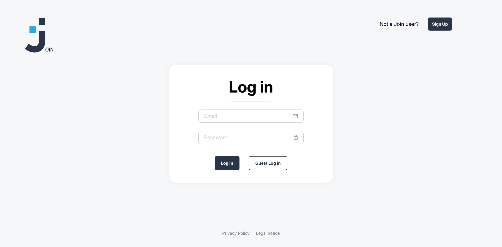
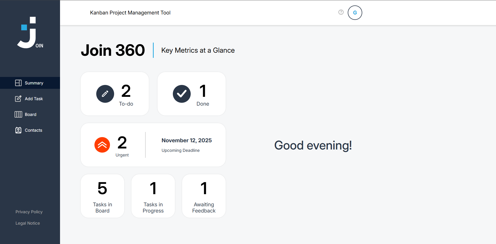
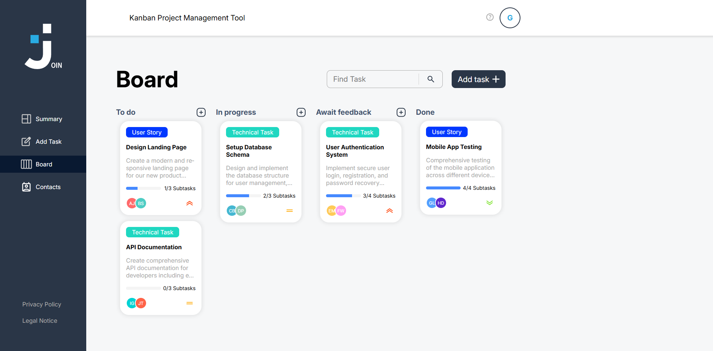
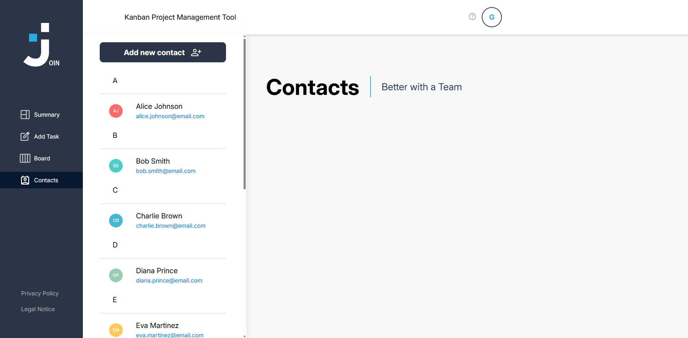
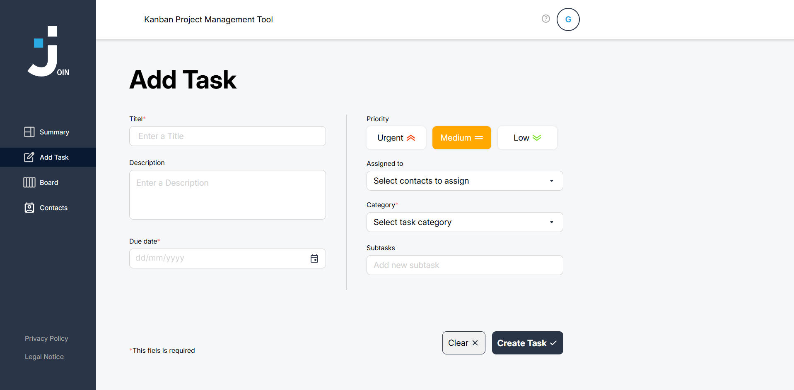

<div align="center">
  <h1>Join</h1>
  <p>
    Join is a Kanban-inspired task management application designed to streamline project and workflow organization.
    Users can create tasks, assign categories and priorities, manage contacts, and track progress across different workflow stages using a drag-and-drop interface.
    The application uses Firebase for real-time data storage and synchronization, combined with a responsive and interactive JavaScript frontend.</p>
</div>

<h2>Features</h2>

<ul>
  <li>Kanban-style task management</li>
  <li>Drag-and-drop task organization</li>
  <li>Create, edit, and delete tasks</li>
  <li>Task priorities and categories</li>
  <li>Firebase real-time database integration</li>
  <li>Persistent cloud-based task storage</li>
  <li>Responsive dashboard layout</li>
  <li>Dynamic UI rendering</li>
</ul>

<h2>Technologies</h2>

<p align="center">
  

  

  

  
</p>

<h2>Preview</h2>

<div align="center">
  

  

  

  

  

</div>

<h2>Live Demo</h2>
<p align="center">
  <a href="https://join.gross-david.de/" target="_blank">
    
  </a>
</p>

<h2>Installation</h2>
<p>Clone the repository:</p>

```bash
git clone https://github.com/DavidGrossDev/join.git
```
<p>
Open the project folder and launch <code>index.html</code> in your browser.
</p>

<h2>Project Structure</h2>

```text
join/
│
├── index.html
├── add_task.html
├── board.html
├── contacts.html
├── summary.html
│
├── style/
│   ├── board.css
│   ├── contacts.css
│   ├── add_task.css
│   ├── login.css
│   ├── responsive.css
│   └── shared_components.css
│
├── script/
│   ├── board.js
│   ├── add_task.js
│   ├── contacts.js
│   ├── firebase.js
│   ├── login.js
│   ├── templates.js
│   └── user_management.js
│
├── fonts/
└── assets/
```

<h2>What I Learned</h2>

<ul>
  <li>Integrating Firebase into frontend applications</li>
  <li>Managing cloud-based data persistence</li>
  <li>Building drag-and-drop interfaces</li>
  <li>Handling asynchronous database operations</li>
  <li>Dynamic rendering with JavaScript</li>
  <li>Responsive dashboard layouts</li>
  <li>Managing application state and workflows</li>
</ul>

<h2>Author</h2>
<p>David Groß</p>
<p>GitHub: <a href="https://github.com/DavidGrossDev">DavidGrossDev</a></p>
